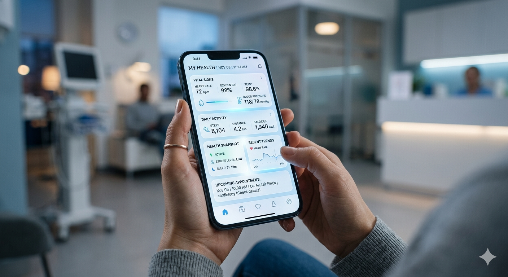

# A Nova Era do Cuidado: Como a IA Redefiniu o seu Bem-Estar 🏥✨

## 📒 Descrição
Este e-book explora a transição da medicina reativa para a saúde preditiva, detalhando como a IA atua como um copiloto na jornada do bem-estar pessoal.

## 🤖 Tecnologias Utilizadas
- **ChatGPT**: Para a estruturação do roteiro e criação do conteúdo técnico.
- **Python (WeasyPrint)**: Para a geração do PDF profissional.
- **Gemini**: Para auxílio na curadoria e organização do desafio.

## 🧐 Processo de Criação
O roteiro foi gerado por IA com foco em três pilares: diagnósticos digitais, wearables e nutrição de precisão. O conteúdo foi formatado num PDF estruturado para simular um guia informativo de saúde moderna.

## 🚀 Resultados
- [ACEDA AO E-BOOK AQUI](./Ebook_Saude_Digital_IA.pdf)

## 💭 Reflexão
O desafio de criar algo "Natty" na saúde digital é equilibrar a inovação tecnológica com a credibilidade, mantendo o foco no bem-estar humano.
